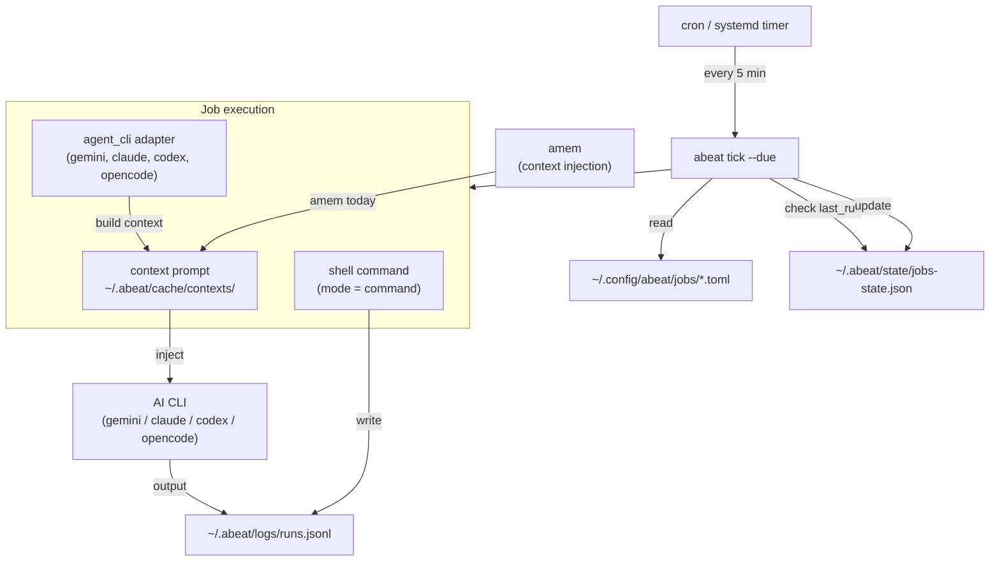

# abeat

Local-first heartbeat runner to run periodic jobs  for AI assistant or AI agent workflows.

`abeat` is designed to run on top of ordinary POSIX tools (`cron`, `systemd --user`, shell commands, local CLI tools) without requiring a daemon, external service, or a custom agent runtime.

It uses:

- `~/.config/abeat/` for job definitions and config
- `~/.abeat/` for runtime state, logs, locks, and cached context artifacts

## Architecture



**Key design principle:** `abeat` is a stateless one-shot runner, not a daemon. It relies on the OS scheduler (`cron` or `systemd --user`) to be invoked periodically. Each `abeat tick --due` run checks all enabled jobs, executes only those past their schedule, and records results to `runs.jsonl`.

## What `abeat` Does

- runs due jobs with `abeat tick --due` (one-shot scheduler tick)
- stores job definitions as TOML files (`~/.config/abeat/jobs/*.toml`)
- supports shell command jobs (`action.mode = "command"`)
- supports built-in one-shot AI agent adapters (`action.mode = "agent_cli"`)
  - `codex`, `gemini`, `claude`, `copilot`, `opencode`
- records per-run logs (`runs.jsonl`, `stdout`, `stderr`)
- supports a no-op contract via `HEARTBEAT_OK`
- optionally injects `amem` context into `agent_cli` jobs

## Install

Build and install from source:

```bash
cd /home/yuiseki/Workspaces/repos/abeat
cargo install --path .
```

Run without installing:

```bash
cargo run -q -- --help
```

## Usage

```bash
abeat --help
```

Top-level commands:

- `init`
- `which`
- `tick`
- `run`
- `logs`
- `list` (alias: `ls`)
- `get`
- `set`

## Quick Start

Initialize local directories:

```bash
abeat init
abeat which --json
```

Create an hourly shell job:

```bash
abeat set jobs add \
  --id gyazo-sync-hourly \
  --description "Gyazo画像を直近1日分同期" \
  --kind heartbeat_check \
  --every 1h \
  --agent shell \
  --workspace /home/yuiseki/Workspaces \
  --amem-mode off \
  --exec 'PATH=/home/yuiseki/.asdf/installs/nodejs/23.9.0/bin:/usr/local/bin:/usr/bin:/bin:$PATH gyazo sync --days 1'
```

List jobs:

```bash
abeat ls
abeat get jobs --json
```

Run a single job immediately:

```bash
abeat run gyazo-sync-hourly
```

Execute one scheduler tick (for cron/systemd):

```bash
abeat tick --due
```

View recent run logs:

```bash
abeat logs
abeat logs --job gyazo-sync-hourly --limit 50
abeat logs --status error
```

## Scheduler Model

`abeat` is a one-shot runner, not a daemon.

Recommended pattern:

- Use OS scheduler (`cron` or `systemd --user timer`)
- Trigger `abeat tick --due` periodically (e.g. every 5 minutes)
- `abeat` checks all enabled jobs and runs only those that are due

Example `cron` entry:

```cron
*/5 * * * * /home/yuiseki/.cargo/bin/abeat tick --due >> /home/yuiseki/.abeat/state/runner.log 2>&1
```

## Main Commands

### `abeat init`

Create default config/runtime directories (idempotent):

- `~/.config/abeat/`
- `~/.abeat/`

### `abeat which [config|runtime|jobs|logs] [--json]`

Print resolved paths.

Examples:

```bash
abeat which
abeat which jobs
abeat which --json
```

### `abeat list` / `abeat ls` / `abeat get jobs`

List job definitions.

- `--json`: machine-readable output

Text mode columns:

- `ID`
- `KIND`
- `SCHEDULE`
- `ENABLED`
- `AGENT`
- `DESCRIPTION`

Note on `source`:

- `source` still exists in JSON output (`abeat get jobs --json`)
- it is the job-definition filename stem (e.g. `owner-interest-diary-hourly`)
- text `ls` omits it because it is often identical to `id`

### `abeat get job <id> [--json]`

Show a single job definition.

### `abeat logs`

View `runs.jsonl` entries (append-only run records).

Options:

- `--job <id>`
- `--status <ok|no-op|error|skipped_locked>`
- `--limit <n>`

### `abeat run <job-id>`

Run one job immediately (manual trigger).

### `abeat tick --due`

Run one scheduler pass and execute only due jobs.

## Job Write Commands

### `abeat set jobs add ...`

Create a new job TOML file under `~/.config/abeat/jobs/`.

Common fields:

- `--id`
- `--description`
- `--kind heartbeat_check|scheduled_task`
- `--every <duration>` or `--cron "<expr>"`
- `--agent <name>`
- `--workspace <path>`
- `--amem-mode <auto|on|off>`
- `--no-op-token <token>` (default: `HEARTBEAT_OK`)

Action selection:

- shell command job:
  - `--exec '<command>'`
  - optional `--shell bash`
- agent CLI job:
  - `--prompt-inline '...'`
  - or `--prompt-template <name-or-path>`

### `abeat set job <id> <enable|disable>`

Alias-friendly state change for a single job.

Examples:

```bash
abeat set job hatebu-sync-hourly disable
abeat set job hatebu-sync-hourly enable
```

### `abeat set jobs enable|disable <id>`

Also supported (same behavior as `set job`).

Current status of other write commands:

- `abeat set jobs update`: not implemented yet
- `abeat set jobs rm`: not implemented yet

## Job Definition Format (TOML)

Canonical format: one file per job (`~/.config/abeat/jobs/<job-id>.toml`).

Example (hourly owner activity summary):

```toml
id = "owner-interest-diary-hourly"
description = "毎時の活動をGeminiで要約してamem diaryに記録"
kind = "heartbeat_check"
enabled = true
schedule_kind = "every"
every = "1h"
agent = "gemini"
workspace = "/home/yuiseki/Workspaces"
no_op_token = "HEARTBEAT_OK"

[context]
include_repo_agents_rules = true
include_skills_summary = true
include_recent_runs = 3
amem_mode = "off"
amem_today = false
amem_owner_profile = false
amem_open_tasks = false
extra_files = []

[action]
mode = "command"
command = "/home/yuiseki/.config/abeat/scripts/hourly-interest-diary.sh"
shell = "bash"
```

### Key fields

- `id`: logical job id
- `description`: concise human description (shown in `abeat ls`)
- `kind`: `heartbeat_check` or `scheduled_task`
- `enabled`: enable/disable flag
- `schedule_kind`: `every` or `cron`
- `every` / `cron`: schedule value
- `agent`: logical agent name (`shell`, `gemini`, `codex`, etc.)
- `workspace`: working directory for execution
- `no_op_token`: no-op marker (default/recommended: `HEARTBEAT_OK`)

### `[action]`

- `mode = "command"`
  - run shell command via `bash -lc` (or configured shell)
- `mode = "agent_cli"`
  - build context artifact
  - invoke built-in adapter for the selected `agent`
  - normalize output and detect no-op

### `[context]`

Current supported fields include:

- `include_repo_agents_rules`
- `include_recent_runs`
- `amem_mode = auto|on|off`
- `amem_*` toggles
- `extra_files` (manual edit recommended for now)

## `agent_cli` Mode (Built-in Adapters)

`abeat` includes built-in one-shot adapters for:

- `codex`
- `gemini`
- `claude`
- `copilot`
- `opencode`

The runtime builds a context prompt, writes it to:

- `~/.abeat/cache/contexts/<run_id>.md`

Then the adapter runs the underlying CLI in a YOLO/auto-approval style by default:

- `codex`: `--dangerously-bypass-approvals-and-sandbox`
- `gemini`: `--approval-mode yolo`
- `claude`: `--dangerously-skip-permissions`
- `copilot`: `--allow-all`
- `opencode`: injects permissive `OPENCODE_PERMISSION` / `OPENCODE_CONFIG_CONTENT`

### No-op Contract

`HEARTBEAT_OK` is the default and recommended no-op token.

If a job returns the no-op token as a standalone line, `abeat` records the run as:

- `status = "no-op"`

## Runtime Layout

Default config root: `~/.config/abeat`  
Default runtime root: `~/.abeat`

Created by `abeat init`:

- `~/.config/abeat/config.toml`
- `~/.config/abeat/jobs/`
- `~/.config/abeat/prompts/`
- `~/.config/abeat/adapters/` (reserved / future shell adapters)
- `~/.config/abeat/context/`
- `~/.config/abeat/scripts/`
- `~/.abeat/state/jobs-state.json`
- `~/.abeat/state/locks/`
- `~/.abeat/state/runner.log`
- `~/.abeat/logs/runs.jsonl`
- `~/.abeat/logs/stdout/`
- `~/.abeat/logs/stderr/`
- `~/.abeat/cache/contexts/`

## Environment Variables

### Path / roots

- `ABEAT_CONFIG_DIR`: override config root
- `ABEAT_DIR`: override runtime root

### Optional `amem` integration

- `ABEAT_AMEM_BIN`: override `amem` executable path

### Agent CLI adapter binaries

- `ABEAT_CODEX_BIN`
- `ABEAT_GEMINI_BIN`
- `ABEAT_CLAUDE_BIN`
- `ABEAT_COPILOT_BIN`
- `ABEAT_OPENCODE_BIN`

### OpenCode adapter options

- `ABEAT_OPENCODE_AGENT` (default: `build`)
- `ABEAT_OPENCODE_PERMISSION`
- `ABEAT_OPENCODE_CONFIG_CONTENT`
- pre-set `OPENCODE_PERMISSION` / `OPENCODE_CONFIG_CONTENT` are also honored

## Current Limitations (MVP)

- `abeat set jobs update` is not implemented yet
- `abeat set jobs rm` is not implemented yet
- `abeat get runs` is not implemented yet (`abeat logs` instead)
- `timeout` and `cooldown` fields exist in schema/CLI but are not enforced at runtime yet
- `agent_cli` is one-shot only (no interactive seed/resume bridge)

## Development

```bash
cd /home/yuiseki/Workspaces/repos/abeat
cargo fmt
cargo test
cargo build
```

## ADR

Architecture decisions are documented in:

- `docs/ADR/README.md`
